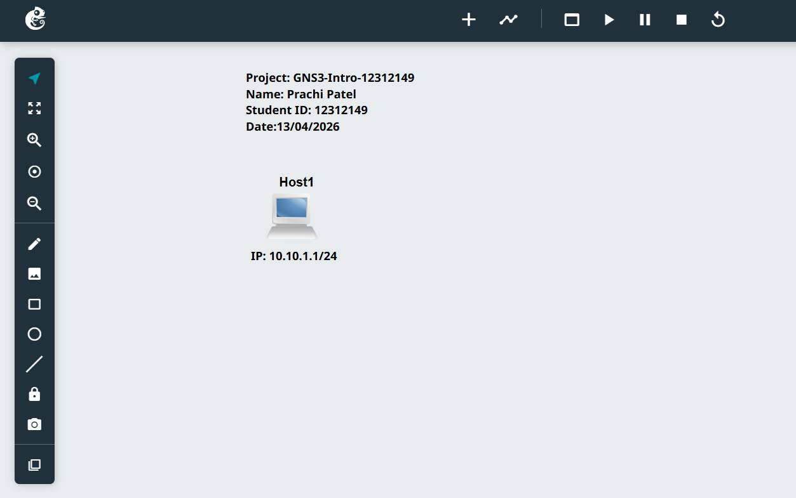
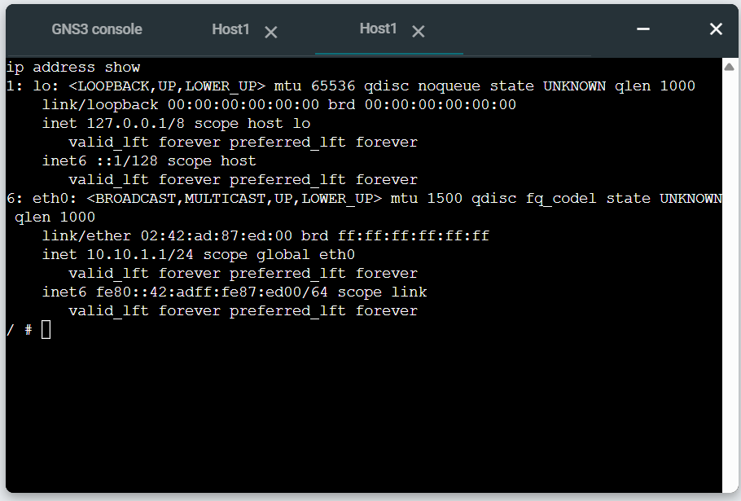

# Week 1 Portfolio
## Objectives
The objective of this week’s tutorial was to become familiar with the basic functions of GNS3, including project creation, Linux host setup, static IP address configuration, annotations, and the use of Linux commands in the web console.

## Tasks Completed
In Week 1, I created a new GNS3 project named `GNS3-Intro-12312149`. I added one Linux Host node to the workspace and inserted text annotations showing the project title, my name, student ID, date, and unit details. I selected the IP address `10.10.1.1/24` for the host and labelled it near the node.

Before starting the node, I configured a static IP address through the `/etc/network/interfaces` file. After starting the host, I opened the web console and used the appropriate Linux command to verify that the IP address had been successfully assigned to the `eth0` interface.

 ## Configuration Used
```bash
auto eth0
iface eth0 inet static
   address 10.10.1.1
   netmask 255.255.255.0
   up sysctl net.ipv4.ip_forward=0
```
## Network 

## IP Address



## Testing Result
The output of the ip address show command confirmed that the host was successfully configured with the static IPv4 address 10.10.1.1/24 on the eth0 interface. This verified that the network configuration was correct and active after the node was started.

## Key Concepts Learned
This tutorial introduced the basic GNS3 environment and showed how a Linux host can be configured with a static IP address before startup. I learned that the /etc/network/interfaces file is used to define persistent network settings and that the ip address show command can be used to confirm whether the configuration has been applied correctly.
I also learned that IP forwarding should be disabled on a normal host device when it is not intended to act as a router.

## Reflection
This activity provided a useful introduction to the tools and configuration methods that will be used throughout the unit. It helped me understand the importance of accurate IP addressing and proper verification of network settings. By completing this task, I became more confident in using GNS3 and basic Linux networking commands, which will support more advanced tasks in later weeks.
