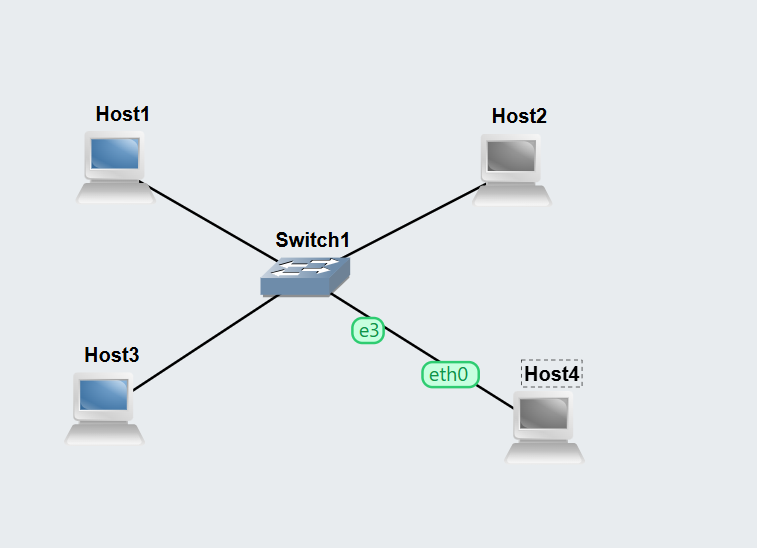
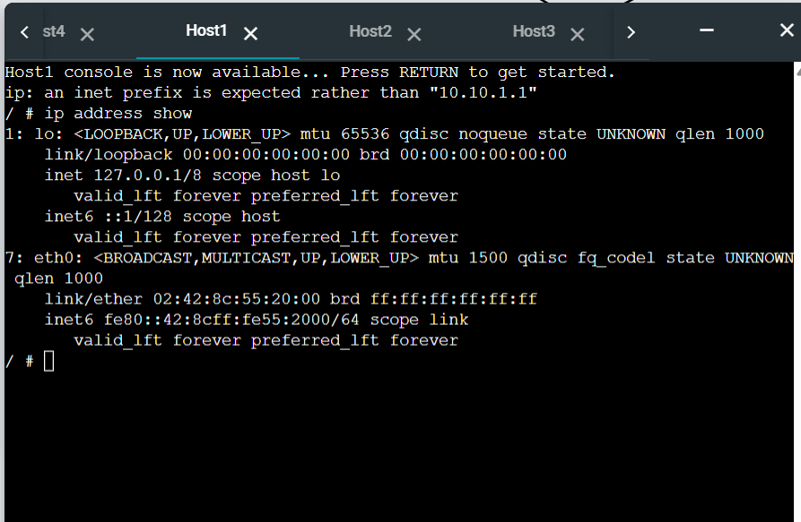
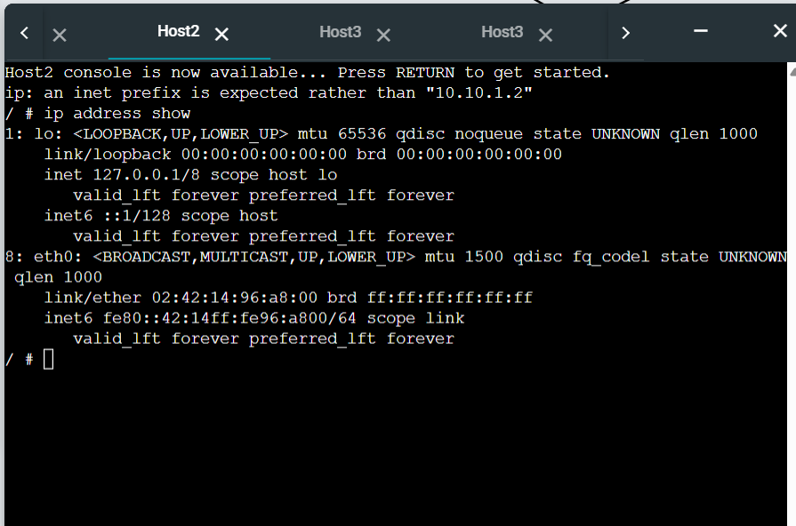
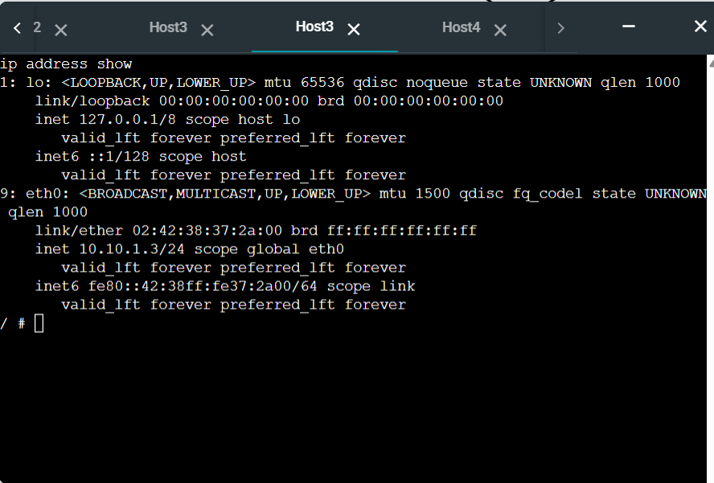
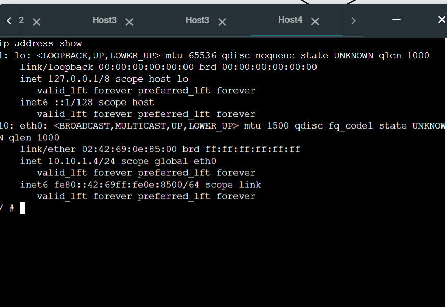

## Task 1: Setting Static IP Addresses
## Aim
The aim of this task was to configure static IP addresses on Linux hosts using three different methods in GNS3. These methods included using the GNS3 Configure menu, editing the /etc/network/interfaces file, and using the ip address add command.

## Topology Setup
A project named Setting-IP-12312149 was created in GNS3. The topology consisted of four Linux hosts and one Ethernet switch connected in the same LAN. The IPv4 network 10.10.1.0/24 was used.
The IP addresses assigned were:
Host1: 10.10.1.1/24
Host2: 10.10.1.2/24
Host3: 10.10.1.3/24
Host4: 10.10.1.4/24

-> GNS3 topology showing four Linux hosts connected to one Ethernet switch.

This screenshot shows the complete network topology created in GNS3. It contains four Linux hosts connected to a single Ethernet switch in the same LAN.

Host1 and Host2 Configuration
Host1 and Host2 were configured using the GNS3 Configure menu before starting the nodes. This method applies the IP settings automatically when the hosts are started.

1) Host1 IP address verification.

This screenshot shows the console output of Host1 using the Ip address show command. It confirms that Host1 was assigned the IP address 10.10.1.1/24.

 	
2) Host2 IP address verification.

This screenshot shows the console output of Host2 using the Ip address show command. It confirms that Host2 was assigned the IP address 10.10.1.2/24.

Host3 Configuration Using /etc/network/interfaces
Host3 was configured by editing the /etc/network/interfaces file in the Linux console. After saving the file, the interface was reloaded so the changes could take effect 
3) Host3 IP address verification after editing /etc/network/interfaces.

This screenshot shows the console output of Host3 after configuring the static IP address through the /etc/network/interfaces file. It confirms that Host3 was assigned the IP address 10.10.1.3/24.
________________________________________
Host4 Configuration Using Ip address add
Host4 was configured using the Ip address add command. This method applies the IP address immediately, but it is temporary and does not remain after rebooting the host 
Host4 IP address verification using the Ip command.

This screenshot shows the console output of Host4 after assigning the IP address using the Ip address add command. It confirms that Host4 was assigned the IP address 10.10.1.4/24.
________________________________________
Task 1 Conclusion
This task demonstrated three different methods for assigning static IP addresses to Linux hosts in GNS3. All four hosts were successfully configured within the same network, and the assigned IP addresses were verified using the Ip address show command.
________________________________________
Task 2: Testing Network Connectivity and Delay with Ping
Aim
The aim of this task was to use the ping command to test connectivity and measure round-trip delay between hosts in the network 
Basic Ping Test
A normal ping test was carried out from one host to another host in the same LAN. This verified that the destination host was reachable and allowed observation of the round-trip time.

1)	Successful ping between two hosts in the LAN.

This screenshot shows a successful ping command between two hosts in the same network. The reply messages confirm that the destination host is reachable and communication is working correctly.
________________________________________
2)	Ping to a Wrong IP Address

A ping was then sent to an unused IP address in the same network. No reply was received, and the result showed packet loss, demonstrating that the destination did not exist.
 Ping to an invalid IP address showing packet loss.:
This screenshot shows the result of pinging a wrong IP address in the same network. Since no device existed at that address, the ping failed and the statistics showed 100% packet loss.
________________________________________
Ping with Options
A final ping test was performed using non-default options to control the number of packets, interval, and packet size.
3)	Ping using non-default options.

This screenshot shows a ping command using -c, -i, and -s options. These options were used to limit the packet count, change the time interval, and set a different packet size.
________________________________________
Task 2 Conclusion
This task showed how the ping command can be used to test host reachability, identify packet loss, and measure delay. It also demonstrated how different options can be used to modify the operation of the command.
________________________________________
Overall Conclusion
This week’s tutorial provided practical experience in Linux IP address configuration and basic network testing in GNS3. The tasks demonstrated how to set static IP addresses using multiple methods and how to verify network connectivity using the ping command.

