## Week 04 Tutorial Report
- Student Name: Prachi Patel
- Student ID: 12312149
- Unit: COIT20261

## Task 1: View Routing Tables
- The aim of this task is to understand how routing tables operate in a network and how packet forwarding is enabled on a router. This involves configuring static IP addresses, enabling/disabling forwarding, and verifying connectivity between different subnets

## Network Design
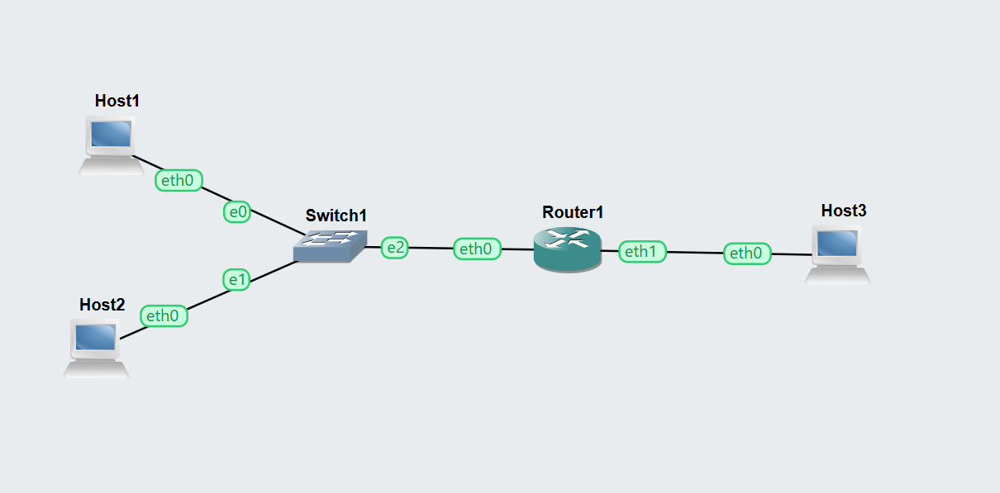

- This network consists of three Linux hosts, one Linux router, and one Ethernet switch. Host1 and Host2 are connected to the switch along with the router’s first interface (eth0), forming the first subnet (10.1.1.0/24). Host3 is connected directly to the router’s second interface (eth1), forming the second subnet (10.1.2.0/24). This setup enables communication between two different subnets through the router.

## IP Configuration and Routing Tables

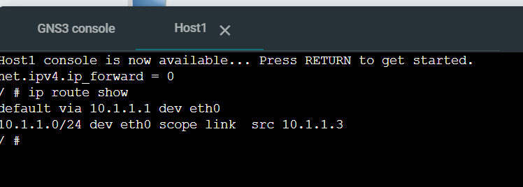

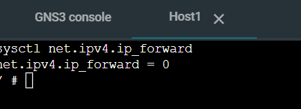

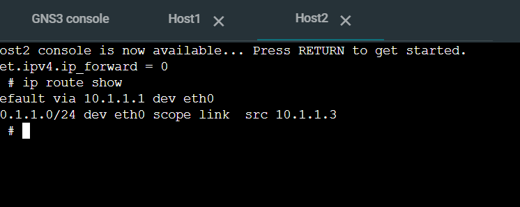

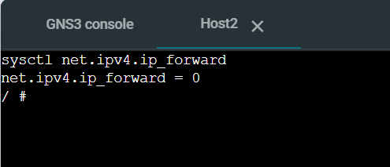

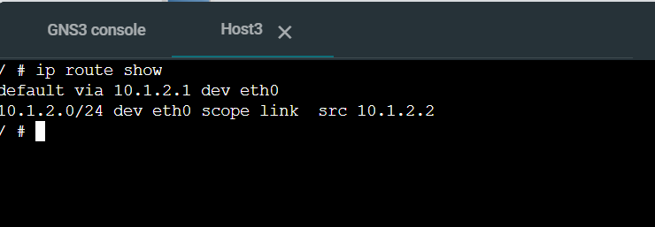

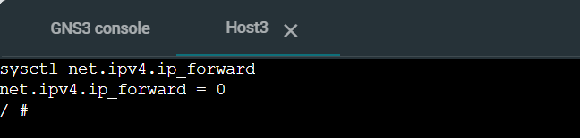

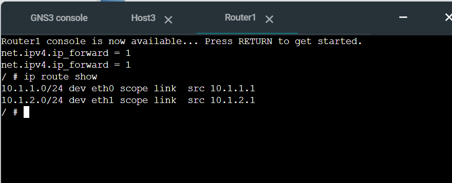

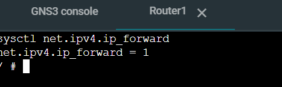

The IP configuration shows that each host is assigned a static IP address within its respective subnet. The router has two interfaces configured for both subnets. Forwarding is disabled on all hosts (ip_forward = 0) and enabled on the router (ip_forward = 1). Each host contains a default route pointing to the router, while the router maintains routes for both connected subnets.

## Connectivity Test
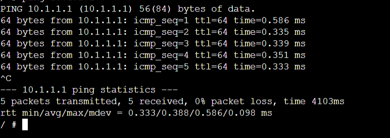

This figure demonstrates successful communication between hosts located in different subnets. The ping results confirm that the router is correctly forwarding packets between the two networks, indicating that the routing configuration is functioning as expected.

## Summary of Task 1
In this task, a network with two subnets was successfully created and configured using static IP addressing. Routing tables were examined on all devices, and packet forwarding was enabled on the router. Connectivity between the subnets was verified using the ping command, demonstrating correct routing behaviour.

## Task 2: Dynamic Routing with OSPF
The aim of this task is to observe how dynamic routing protocols such as OSPF operate and how they automatically adjust to network changes such as link failures.

## Network Overview

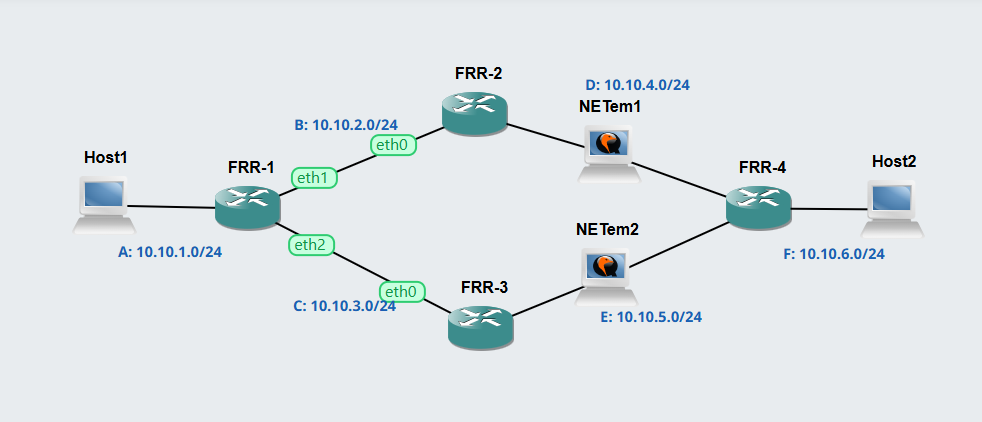

The network topology consists of two end hosts (Host1 and Host2) and four routers (FRR1, FRR2, FRR3, and FRR4). The routers are interconnected in such a way that there are two possible paths between the hosts. The top path is via FRR2, while the bottom path is via FRR3. Each link is assigned a separate subnet ranging from 10.10.1.0/24 to 10.10.6.0/24. Two NETem nodes are placed between FRR2–FRR4 and FRR3–FRR4 to simulate link behaviour and failures. This topology is used to demonstrate dynamic routing using OSPF.
OSPF Network Topology.

## OSPF Neighbour Information
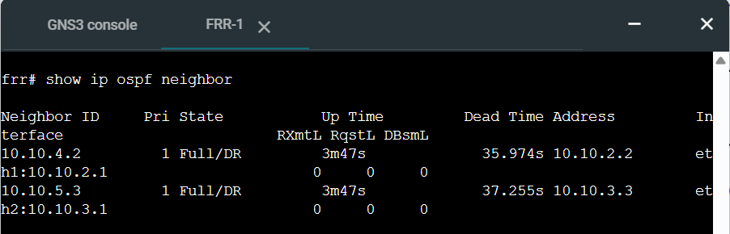

The output of the command show ip ospf neighbor on FRR1 displays the neighbouring routers participating in OSPF. FRR1 has two neighbours:

FRR2 with IP address 10.10.2.2
FRR3 with IP address 10.10.3.3

Both neighbours are in the Full/DR state, indicating that OSPF adjacency has been successfully established and routing information is being exchanged between routers. This confirms that the OSPF protocol is functioning correctly in the network.

## OSPF Routing Table
The output of the command show ip ospf route shows the routes learned dynamically through OSPF. FRR1 has knowledge of all network subnets, including:

Directly connected networks: 10.10.1.0/24, 10.10.2.0/24, and 10.10.3.0/24
Remote networks learned via OSPF:
10.10.4.0/24 via FRR2
10.10.5.0/24 via FRR3
10.10.6.0/24 via FRR2

This demonstrates that OSPF is automatically sharing routing information between routers and building a complete network view.
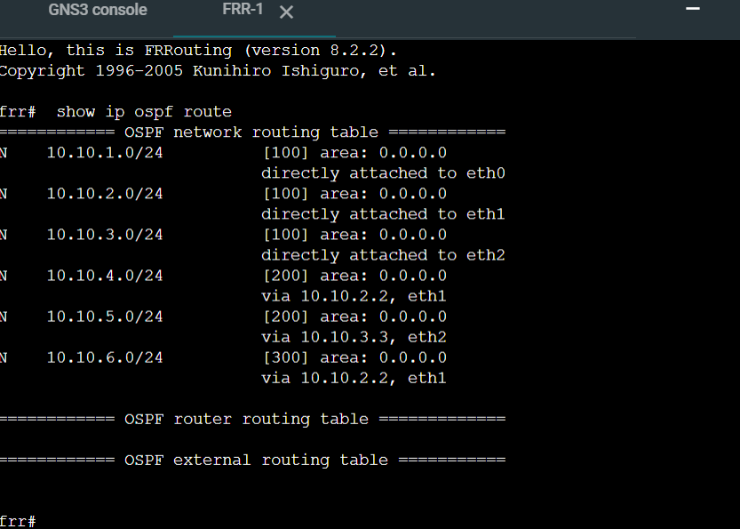

## Linux Routing Table
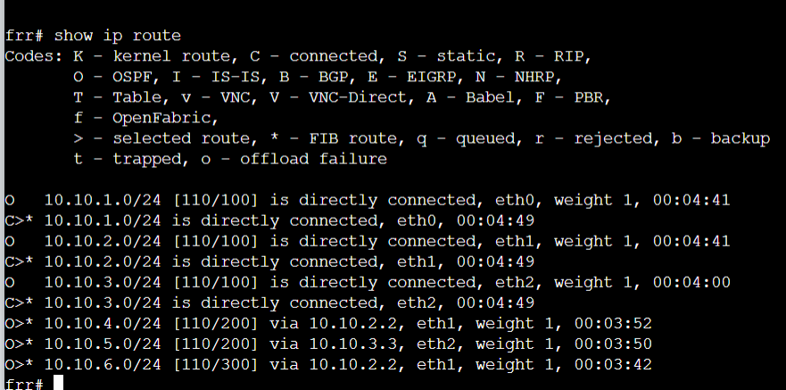

The output of the command show ip route displays the routing table used by the router for packet forwarding. The table includes:

Routes marked with C (Connected), representing directly connected networks
Routes marked with O (OSPF), representing dynamically learned routes

For example:

Traffic to 10.10.6.0/24 is forwarded via 10.10.2.2 (FRR2)
Traffic to 10.10.5.0/24 is forwarded via 10.10.3.3 (FRR3)

This confirms that OSPF is actively determining the best path for data transmission.
## Traceroute
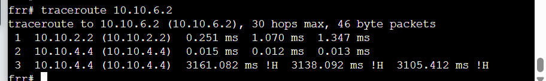

The traceroute command traceroute 10.10.6.2 is used to determine the path taken by packets from Host1 to Host2. The output shows that packets travel through:

First hop: 10.10.2.2 (FRR2)
Second hop: 10.10.4.4 (FRR4)

This indicates that the top path (FRR1 → FRR2 → FRR4) is currently being used by OSPF as the preferred route. The traceroute also displays round-trip time (RTT) values for each hop, providing insight into network performance.
## Summary of Task 2

In this task, the behaviour of OSPF was observed in a pre-configured network. Routing information was analysed using FRR commands, and the impact of a link failure was tested. OSPF successfully adapted to the network change by recalculating routes and maintaining connectivity.

## Final Conclusion

This tutorial demonstrated both static and dynamic routing concepts. Static routing required manual configuration of IP addresses and routes, while dynamic routing with OSPF allowed automatic route discovery and adaptation to network changes. These experiments highlight the importance of routing protocols in maintaining reliable communication in complex networks.
