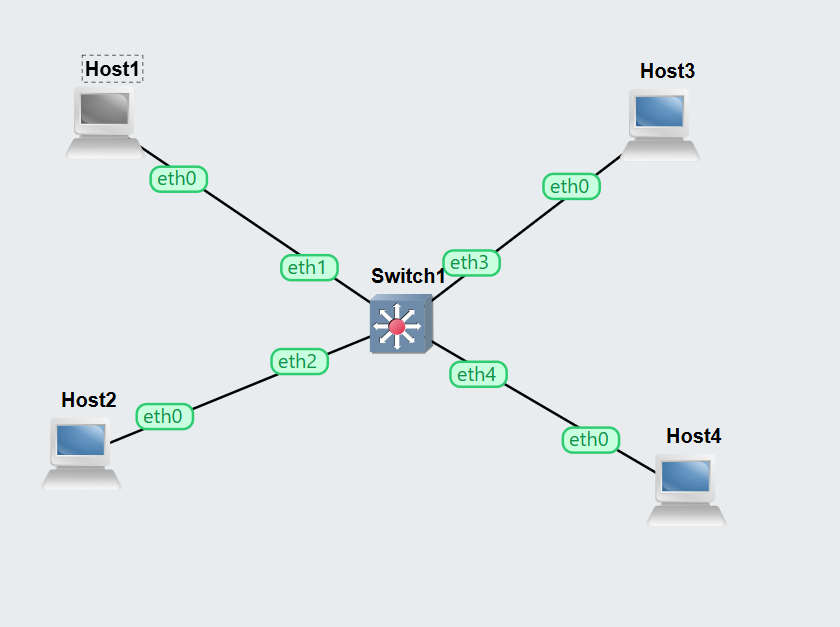
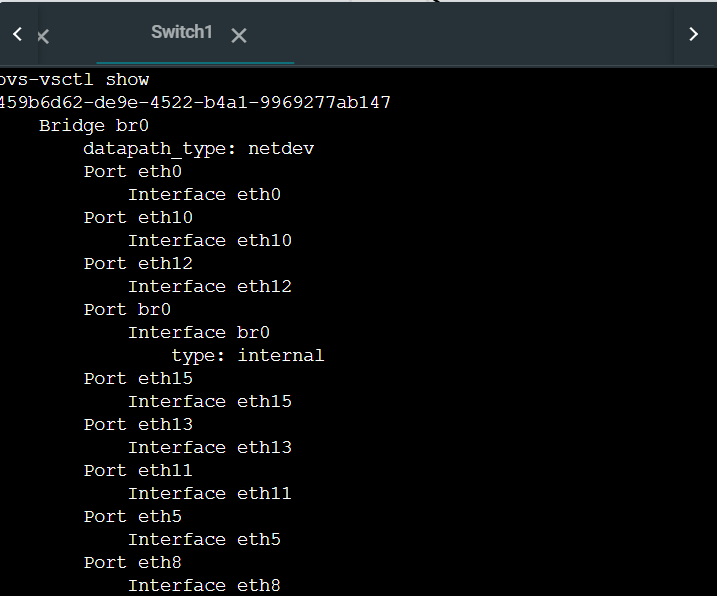
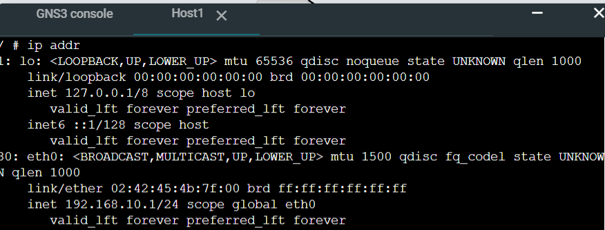
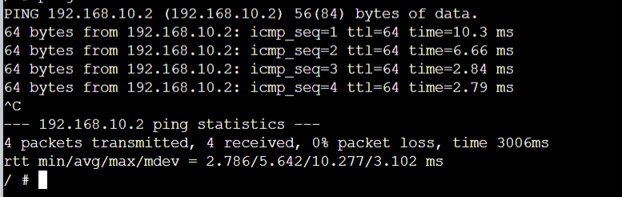
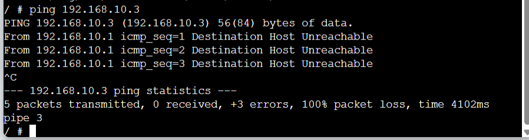
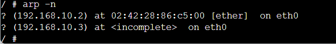
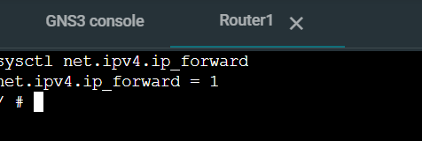
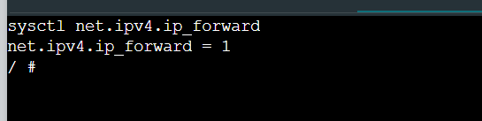
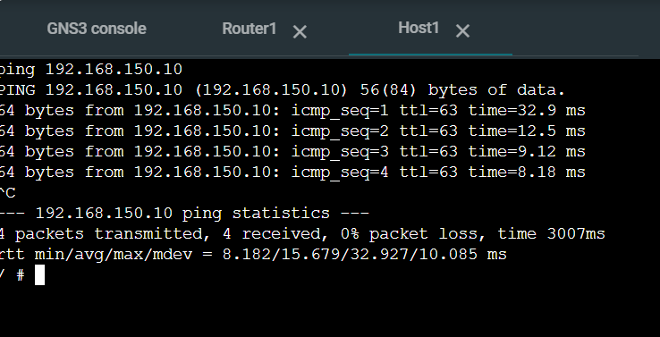

# Task 1: Setup VLANs on Switch

## Aim

To configure VLANs on an OpenvSwitch and verify communication behavior between hosts in same and different VLANs.

### 1. Network Topology

This screenshot shows the GNS3 topology with four Linux hosts connected to the OpenvSwitch. Each host is connected to ports eth1 to eth4, forming the base network structure.

### 2. Switch VLAN Configuration

This screenshot displays the output of `ovs-vsctl show`, confirming VLAN configuration. Ports eth1 and eth2 are assigned to VLAN 149, while ports eth3 and eth4 are assigned to VLAN 150.

### 3. IP Address Configuration

This screenshot shows the IP configuration of Host1 using the `ip addr` command, confirming correct assignment of IP address.

### 4. Successful Ping (Same VLAN)

This screenshot shows successful communication between hosts in the same VLAN (Host1 to Host2), verifying intra-VLAN connectivity.

### 5. Failed Ping (Different VLAN)

This screenshot shows failed communication between different VLANs (Host1 to Host3), confirming VLAN isolation.

### 6. ARP Table

This screenshot shows the ARP table where hosts in the same VLAN have resolved MAC addresses, while hosts in different VLANs show incomplete entries.

## Result

VLAN segmentation was successfully implemented. Hosts in same VLAN communicated successfully, while hosts in different VLANs could not communicate.

## Task 2

### 1. Network Topology

This screenshot shows the updated topology including the Linux router connected to the switch via port eth0.

### 3. IP Forwarding

This screenshot confirms that IP forwarding is enabled on the router, allowing packets to be routed between VLANs.

### 4. Inter-VLAN Ping

This screenshot shows successful ping between hosts in different VLANs, confirming that inter-VLAN routing is working.

## Result

Inter-VLAN routing was successfully implemented. All hosts across VLANs communicated through the router.

# Conclusion

This lab demonstrated VLAN segmentation and inter-VLAN routing. VLANs isolated traffic, and the router enabled communication between VLANs.

---

**Note:** Insert all screenshots at the indicated positions before exporting to PDF.
